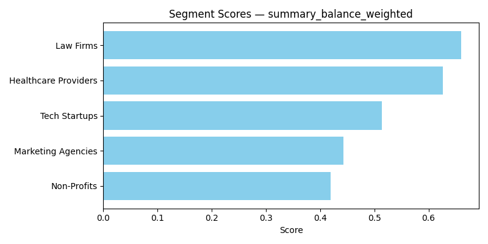
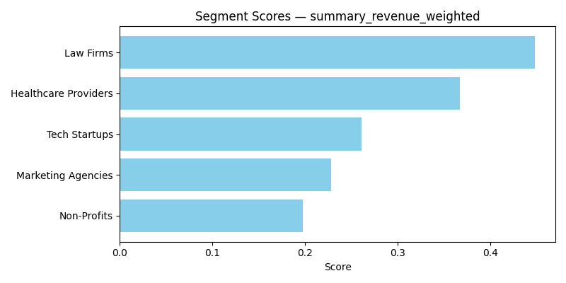
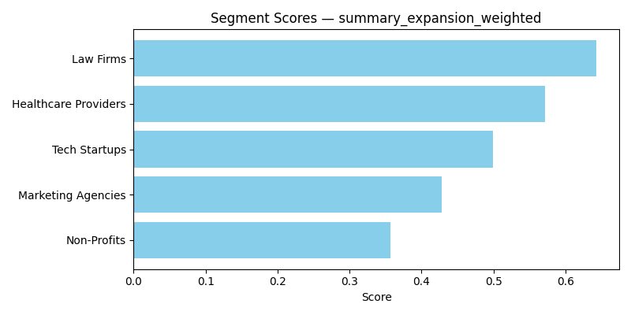
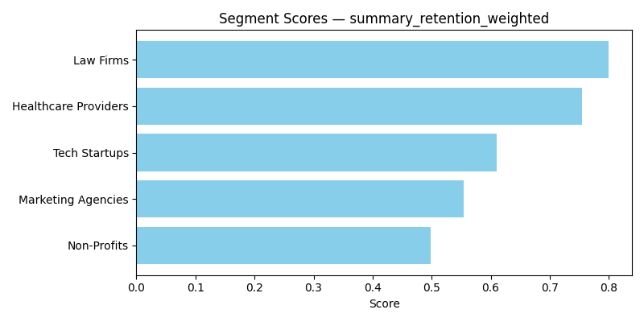
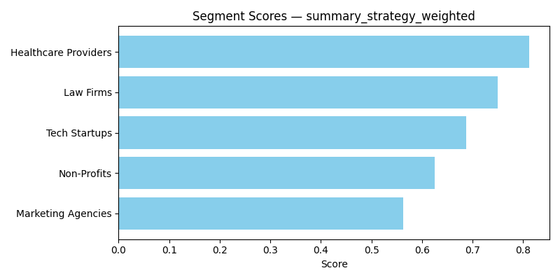
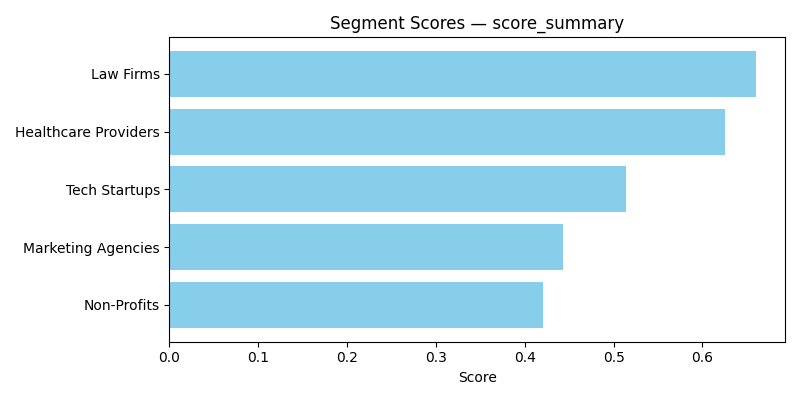

# Strategic Opportunity Assessment  
**Segment Prioritization for Enterprise SaaS Expansion**

## Problem

Our B2B SaaS platform is preparing to expand into new customer segments. We have sought data-driven recommendations on which industries will present the highest value given their revenue, retention rates, scalability, and operational fit.

---

## Process

A dataset of **1,000,000 accounts** was generated across five key industries:

- Tech Startups  
- Healthcare Providers  
- Law Firms  
- Marketing Agencies  
- Non-Profits  

Key performance indicators — such as **net average revenue** (revenue minus cost to serve), **retention rate**, **expansion potential**, and **strategic fit** — were normalized using min-max scaling.

Multiple models were created with varied strategic weightings and composite scoring:

- Balanced  
- Revenue Focused  
- Expansion Focused  
- Retention Focused  
- Strategic-Fit Focused  

Final scores were visualized to support interpretability and stakeholder discussions.

---

## Models & Insights

Each chart below reflects how segments scored under a specific weighting strategy.

### Balanced Model  
Law Firms and Healthcare Providers lead overall — Non-Profits and Marketing Agencies lag behind.  

### Revenue-Focused Model  
Law Firms dominate — Non-Profits underperform.  

### Expansion-Focused Model  
Law Firms and Healthcare Providers are at the top again — Non-Profits are the weakest.  

### Retention-Focused Model  
Law Firms and Healthcare Providers are the front-runners — Non-Profits linger in the rear.  

### Strategic-Fit-Focused Model  
Healthcare Providers head the list — Marketing Agencies and Non-Profits trail.  

### Overall Average Model  
Law Firms and Healthcare Providers consistently hold the top spot — Non-Profits and Marketing Agencies remain weak at the bottom.  

---

## Final Recommendation

**Law Firms** and **Healthcare Providers** emerge as the highest-value segments for strategic focus. They demonstrate strong net revenue, reliable retention, robust expansion potential, and alignment with the product roadmap.

I recommend prioritizing:

- Outbound efforts  
- Onboarding workflows  
- Product customization  

…specifically for **Law Firms** and **Healthcare Providers**.

Meanwhile, it may be fruitful to consider **divesting from Marketing Agencies and Non-Profits**, based on consistent underperformance.